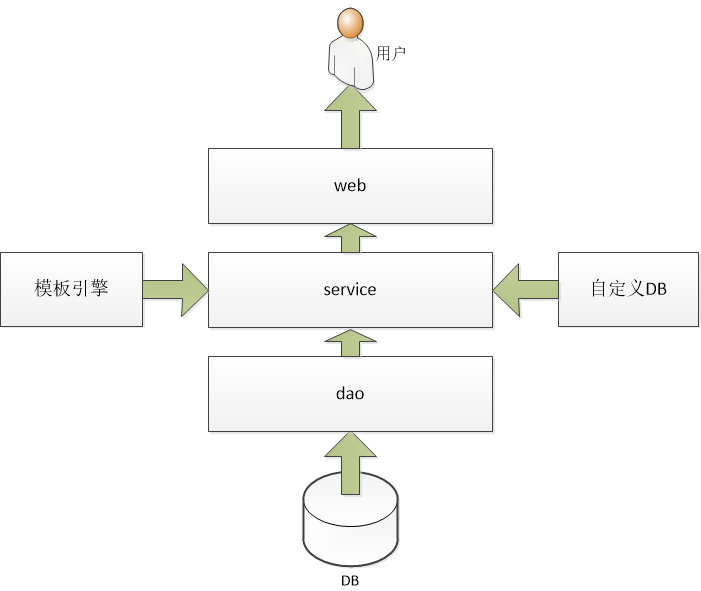
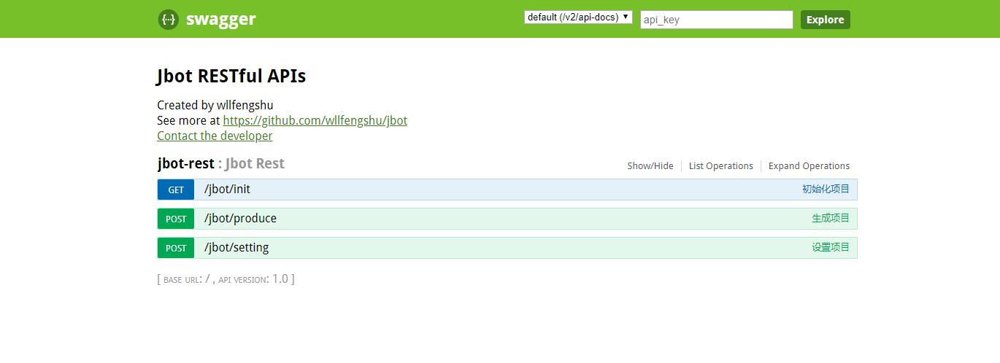
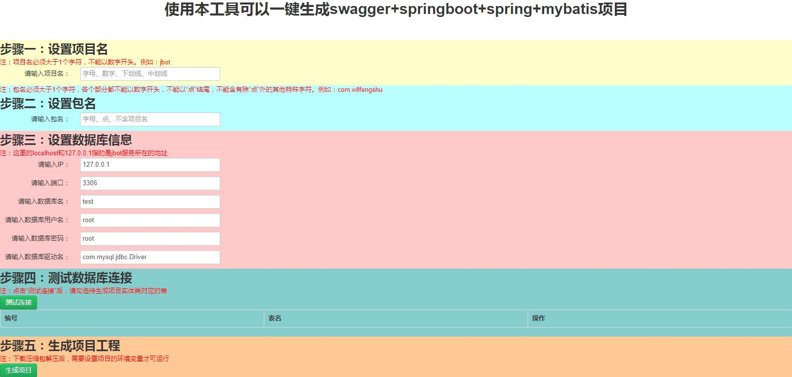
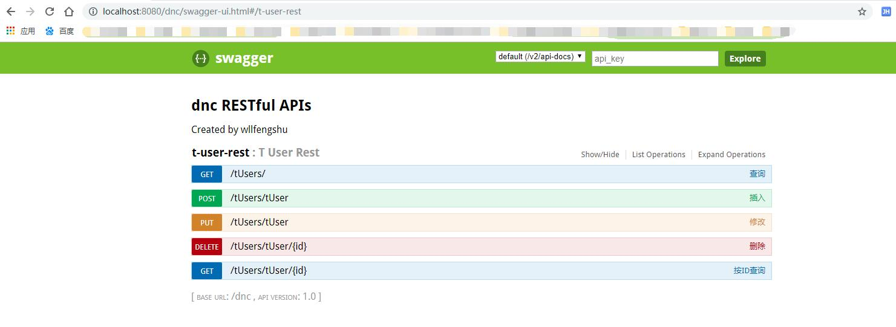
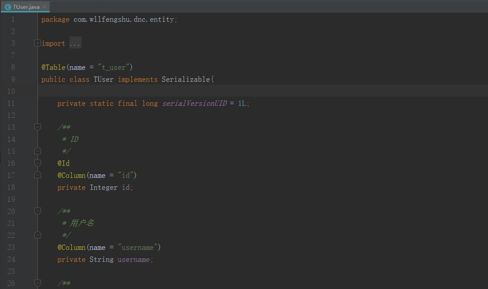
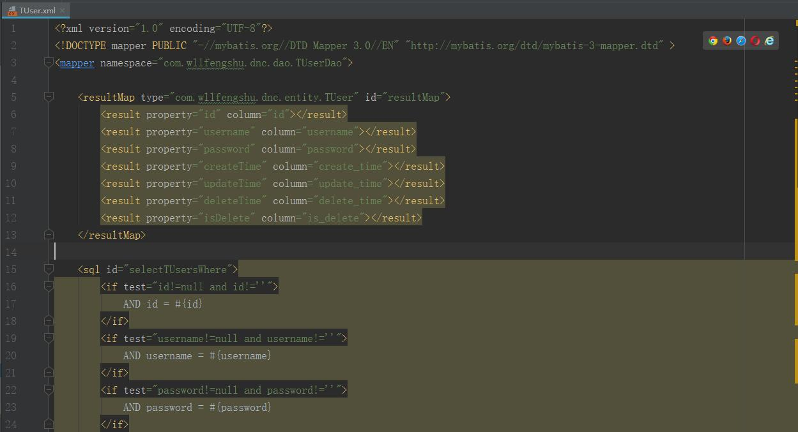
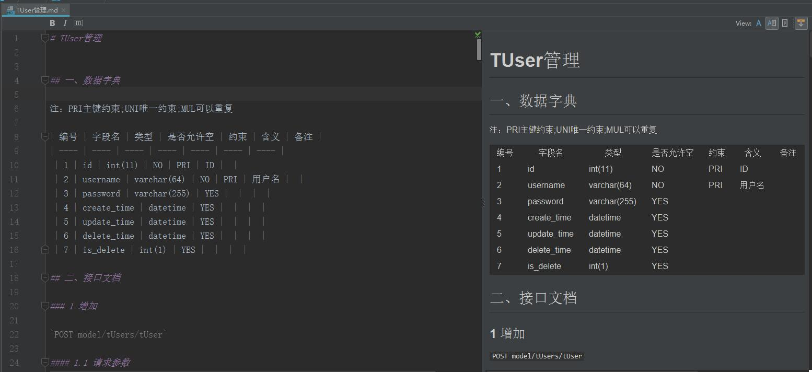

# java项目生成器

[](https://github.com/wllfengshu/jbot)
[](https://github.com/wllfengshu/jbot)
[](LICENSE)

## 项目介绍

jbot项目可以一键生成 swagger + springBoot + spring + mybatis 项目

## 项目结构
```lua
jbot
├── aop ── 切面组件
├── common ── 公共组件
├── configs ── 配置组件
├── dao ── DAO
├── exception ── 异常处理组件
├── model ── Model
├── rest ── Rest
├── security ── 安全控制组件
├── service ── Service
├── Utils ── 工具类组件
├── work ── 模板处理核心组件
```

## 技术选型

### 后端技术
技术 | 名称
----|------
Spring Boot | 容器  
MyBatis | ORM框架
Druid | 数据库连接池
Swagger2 | 接口测试框架
Maven | 项目构建管理
lombok | 代码简化工具
logstash | 日志管理
mapper | 通用mapper
pagehelper | 分页插件
Freemarker | 模板引擎

#### 前端技术
技术 | 名称 
----|------
jQuery | 函式库
Bootstrap | 前端框架
AngularJS | JS框架

## 架构图



## 环境搭建

### 开发工具
- MySql: 数据库
- Tomcat: 应用服务器

### 开发环境
- Jdk8+
- Mysql5.5+
- Maven3.5+

### 本项目使用方法

- 1、启动mysql,并且创建一个名为test的数据库（待生成项目实体类对应的表都必须在test库中创建好）
- 2、设置jbot运行的环境变量（默认配置如下）
      
      - 数据库连接地址： db_url   eg:jdbc:mysql://localhost:3306/test?useUnicode=true&characterEncoding=UTF-8&useSSL=false
      - 数据库用户名： db_username    eg:root
      - 数据库密码： db_paasword    eg:root
      
  注：如果不想设置环境变量，可以手动修改application.yml文件
  
- 3、启动JbotApplication(直接在main方法上右键启动即可)
- 4、使用浏览器打开 http://localhost:8080/jbot/v2/swagger-ui.html 进行接口测试
- 5、使用浏览器打开 http://localhost:8080/jbot/v2/ 进入jbot主页面

### 资源下载
- JDK8 [https://www.oracle.com/technetwork/java/javase/downloads/jdk8-downloads-2133151.html](https://www.oracle.com/technetwork/java/javase/downloads/jdk8-downloads-2133151.html "JDK8")
- Maven [http://maven.apache.org/download.cgi](http://maven.apache.org/download.cgi "Maven")
- Tomcat [https://tomcat.apache.org/download-80.cgi](https://tomcat.apache.org/download-80.cgi "Tomcat")

## 目标项目规范约定
```lua
1、生成的entity、dao、service、serviceImpl、rest分别放到对应的包里，文件名称为表名首字母大写、去掉下划线、驼峰结构；
2、生成的entity的属性名为表字段名的驼峰形式；
3、serviceImpl放的在service包里的impl包里；
4、生成的rest包含swagger，可以使用http://localhost:8080/项目名/swagger-ui.html访问；
5、生成的每张表都对应“增删改查”的方法，可以直接使用；
6、请确保每张表的主键名为id(如果不为id，请手动在生成的entity中使用@Id指明主键)；
```
  注：本项目不支持联合主键，如果是联合主键，请参考自行百度，按照对应的方法修改本项目生成的目标项目
  
## 演示地址

演示地址：https://wllfengshu.github.io/jbot/

## 预览图

- 使用 http://localhost:8080/jbot/v2/swagger-ui.html 访问（jbot接口图）



- 使用 http://localhost:8080/jbot/v2/ 访问（jbot界面图）



- 生成的项目的效果图（使用http://localhost:8080/dnc/swagger-ui.html 访问）



- 生成的项目结构


- 生成的项目dao


- 生成的项目entity



- 生成的项目mapper



- 生成的项目markdown接口文档



- 生成的项目示例

[https://github.com/wllfengshu/jbot-dnc](https://github.com/wllfengshu/jbot-dnc "生成项目示例")


## jbot相关博客

[https://blog.csdn.net/tiandixuanwuliang/article/details/88931276](https://blog.csdn.net/tiandixuanwuliang/article/details/88931276)